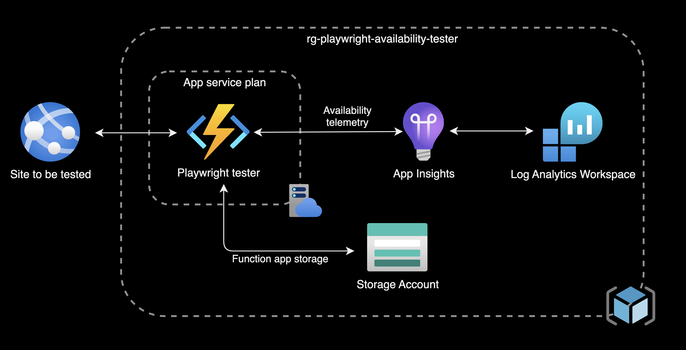
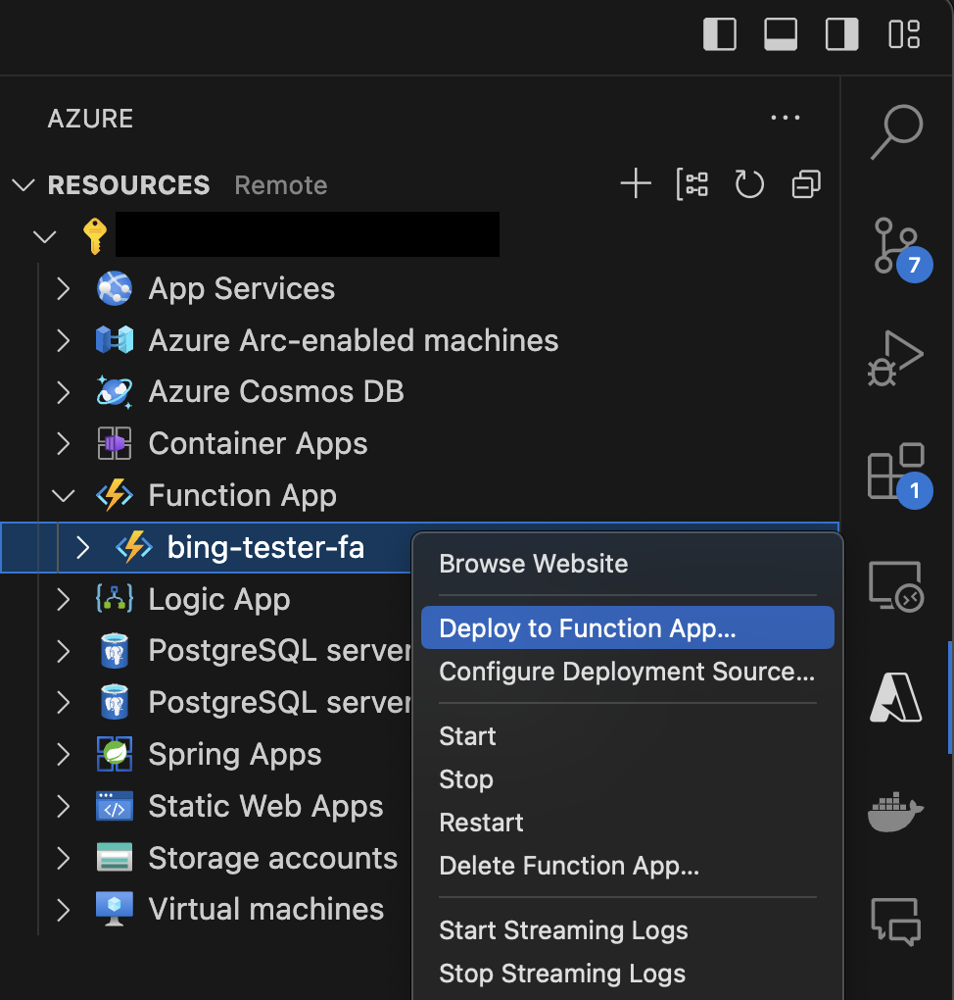
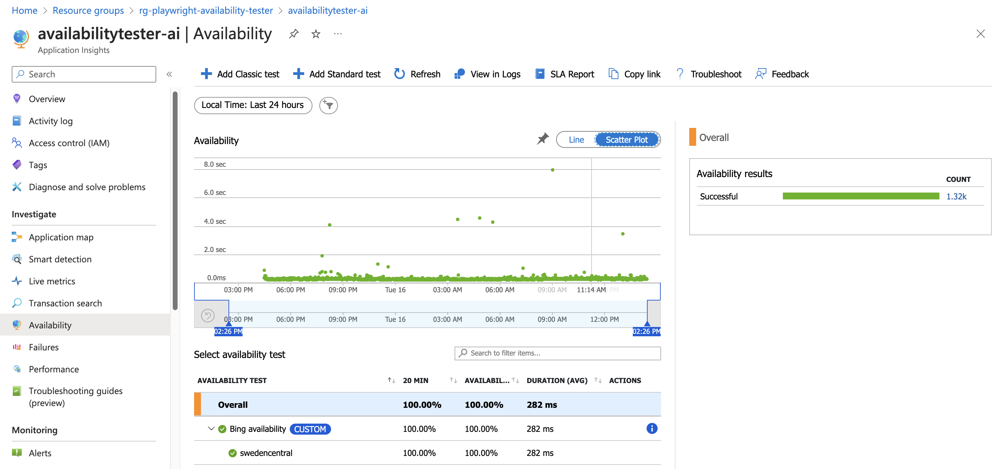

# Playwright testing with azure functions

This is an example Azure project that does frontend testing using [Playwright](https://playwright.dev/), [Azure Functions](https://learn.microsoft.com/en-us/azure/azure-functions/functions-overview), and [Application Insights](https://learn.microsoft.com/en-us/azure/azure-monitor/app/app-insights-overview). This is an implementation based on the blog article from Talha Khaild [Availability test with Node.js and Playwright for Application Insights](https://medium.com/@talhakhalid101/availability-test-with-node-js-and-playwright-for-application-insights-85a4c1d724e7)

A timer based function app will run a playwright frontend test written in javascript. Test results will be pushed as availability telemetry to the App Insights service.

# Get started

The following guide describes the process for setting this example up with Visual Studio Code and deploying to Azure with Terraform. In the example we will do avaiability testing against www.bing.com

## Setup project in VS code

1. Clone the repository to yor local machine
2. From the project root folder, install npm packages

        npm install

3. Install [Azure CLI](https://learn.microsoft.com/en-us/cli/azure/install-azure-cli)

4. Install "Azure" VS Code extension

5. Install "Azure functions" VS Code extension

## Setup Azure CLI

1. Login to azure via Azure CLI

        az login

2. Check that you are using the correct subscription

        az account show

3. If not correct, swith subscription.

        az account set --subscription "Your Subscription Name"

## Deploy Infrastructure in Azure with Terraform

1. Initiate terraform

        cd terraform
        terraform init

2. Display the terraform plan for deployment

        terraform plan

3. Deploy the infrastructure

        terraform apply

## Deploy function app to Azure

1. Open the Azure extension and locate you function app created with the terraform script. Right click it and select "Deploy to function app"

    

2. Application will be deployed and after a while the availability telemetry will be visible in App Insights under the sidebar option "Availability" as a "Custom" availability test.

    

# Change the site to be tested and generate new tests

If you want to test your own website you have to change the function app settings since it is configured by environment variables. This can be done by changing the following variables in [availabilitytester.tf](terraform/availabilitytester.tf). 

    variable "test_name" {
    default     = "Bing availability"
    description = "Name of the availability test"
    }

    variable "test_url" {
    default     = "https://www.bing.com"
    description = "URL to test"
    }

## Generate new playwright tests

To test another website you have to generate new playwright test code for your specific site and update [timerTrigger.js](src/functions/timerTrigger1.js). Guide for test generation can be found at https://playwright.dev/docs/codegen

1. Run the following command within Visual Studio Code terminal to browse the specified website and generate Playwright test code from your interactions with the website.

        npx playwright codegen https://www.bing.com

2. Update [timerTrigger.js](src/functions/timerTrigger1.js) and update the code in the  following block with the code you generated.

        //Start: Playwright test code

        const page = await browser.newPage();
        stopwatch.start();
        await page.goto(process.env.WEB_URL);
        var title = await page.title();
        await expect(title).toBe('Bing');
        availabilityTelemetry.success = true;

        //End: Playwright test code

3. Update the Playwright test code where needed to use the environment variable we are using in the function app for the website URL.

        await page.goto(process.env.WEB_URL);